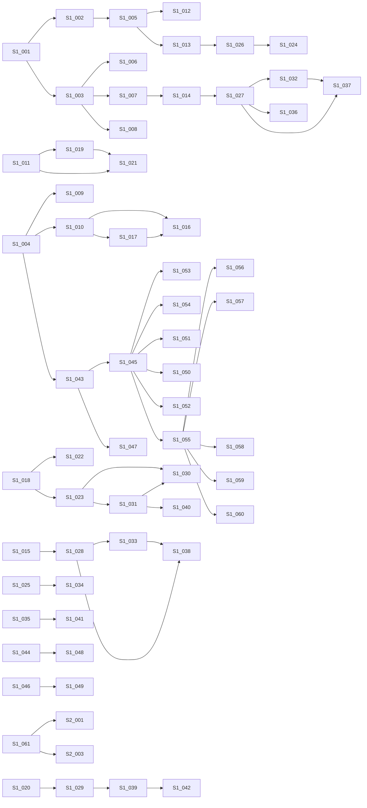
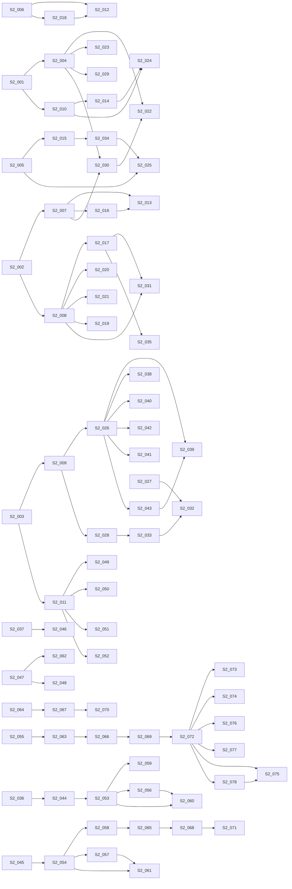
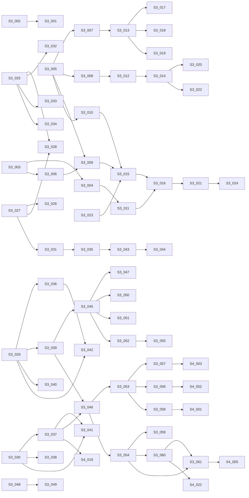
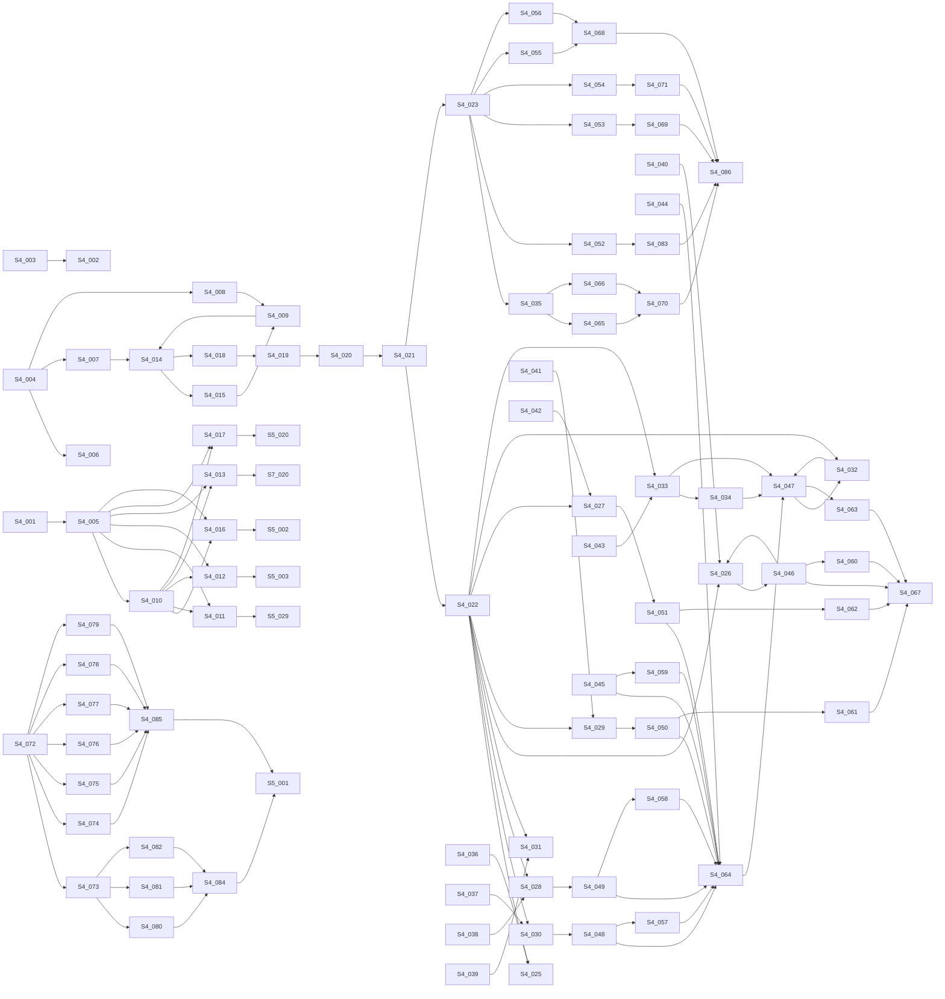
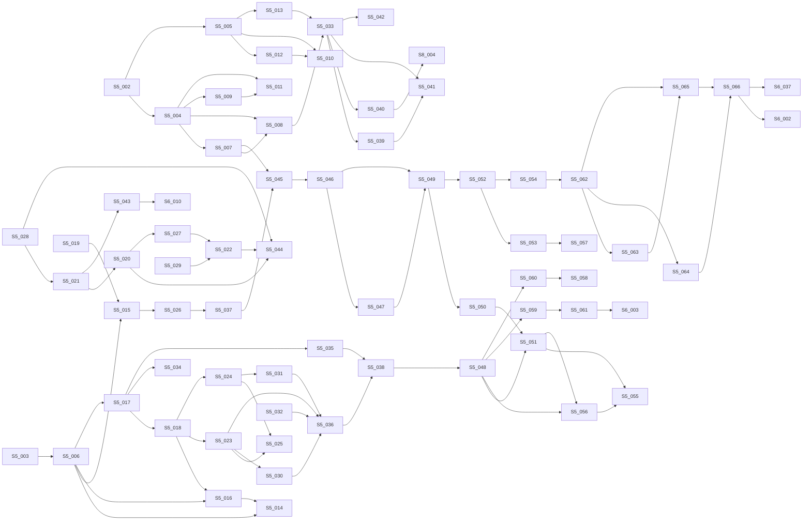
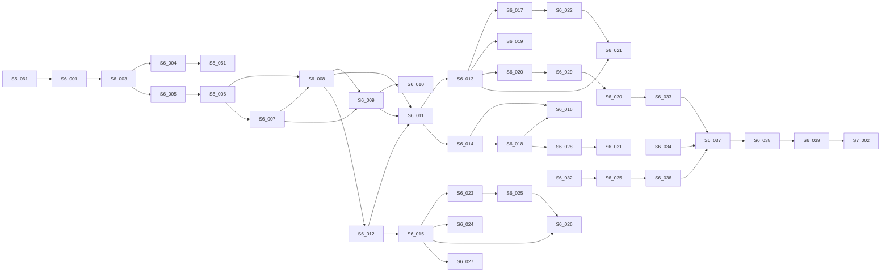
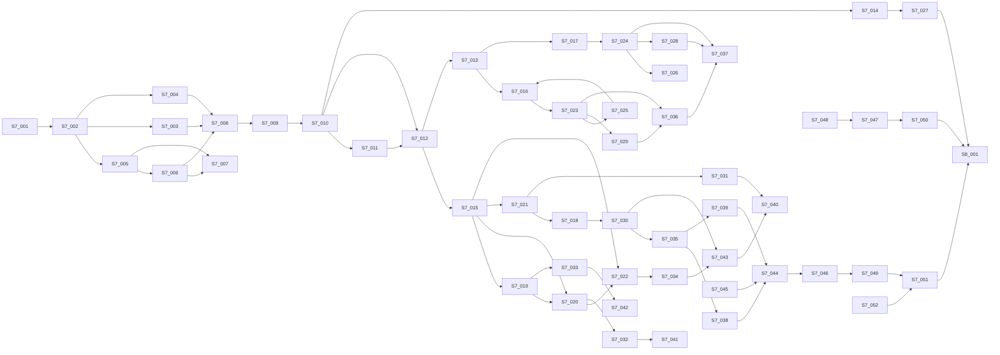
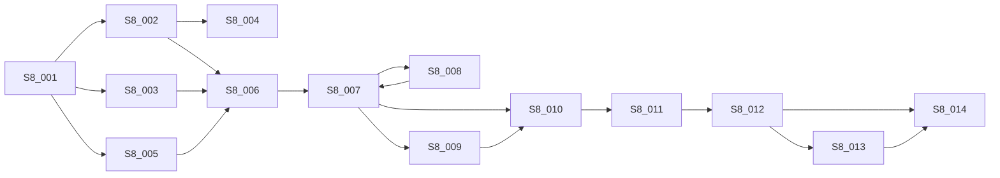

# 墅学家 Pack：EPC 原版全流程拓扑 Markdown 提取稿

> 迁移来源：`/Users/li/Documents/truzhenv3` 本地提交 `3c161aff4e2cc9b6ee896d0ef1ec4b37aaf4b062` 的 `backend/internal/devserver/pack_asset_seed_shuxuejia_topology.md`。
> 当前文件是 Pack 可分发结构化参考资料，不包含原始 PDF；原始 PDF 不进入 Git。

> 状态：拓扑返工导入源。保留 457 个原文节点，并使用 PDF 矢量连接线提取显式边；不是 10 阶段摘要，也不是顺序链。
> 来源 PDF：`/Users/li/Documents/过程文档/EPC工程项目流程图.pdf/EPC工程项目流程图.pdf`。
> UI 使用路径：`场景平台 -> 场景包管理 -> 打开制作台 -> 流程建模`。

## 提取纪律

- 本文件用于 Truzhen 流程建模 UI 导入和 parity 校对。
- 节点原文与坐标来自原节点清单；显式连接来自 PDF 黑色矢量连接线的端点、折线子段和局部总线分支匹配。
- 不使用旧 Mermaid 中的 `Sx_001 -> Sx_002` 顺序边。
- 每条显式边只登记一次；跨段边归入 source 节点所在分段。
- 自动提取无法 100% 确认的跨段长回流、YES / NO 标注和连接线，必须在 UI 中对照 PDF 继续校正。

## 自动提取统计

- 节点数：457
- 节点框匹配数：376
- 显式边数：543
- 未匹配连接端点数：101（初版自动统计；局部总线补边后仍需对复杂施工段做人工 parity）
- Parity 状态：`needs_review`，原因是 PDF 存在跨段长连接、复杂施工段总线和 YES / NO 回流，自动拓扑只能作为 UI 制作底稿。

## 1. 设计准备原版段拓扑段

- 节点数：61
- 本段 source 显式边数：57

### 节点原文清单

- S1_001：设 / 计 / 准 / 备 / 流 / 程（x=143.6, y=724.6）
- S1_002：设计管理（x=275.9, y=453.7）
- S1_003：后期（x=286.1, y=1217.7）
- S1_004：前期（x=287.3, y=713.0）
- S1_005：商务（x=389.9, y=453.7）
- S1_006：设计管理方协调跟进（x=390.4, y=1256.9）
- S1_007：工程管理方介入（x=398.2, y=1198.4）
- S1_008：工程完工（x=409.9, y=1309.6）
- S1_009：签订第三方顾问合同（x=433.2, y=928.7）
- S1_010：拟定工作计划（x=444.9, y=1034.2）
- S1_011：组织会议（x=452.7, y=788.3）
- S1_012：设计建议书（x=543.2, y=469.9）
- S1_013：设计服务书（x=543.2, y=550.0）
- S1_014：图纸会审（x=544.7, y=1198.4）
- S1_015：第三方顾问进度表（x=546.4, y=1034.2）
- S1_016：空间设计进度表（x=550.3, y=995.1）
- S1_017：各方联系名录（x=554.2, y=1073.1）
- S1_018：业务（x=554.9, y=389.8）
- S1_019：第三方顾问公司（x=562.1, y=831.2）
- S1_020：设计管理方（x=569.9, y=788.3）
- S1_021：业主代表（x=573.8, y=753.1）
- S1_022：与业主见面沟通（x=644.7, y=370.5）
- S1_023：了解业主需求（x=648.6, y=423.3）
- S1_024：设计服务周期（x=648.6, y=511.0）
- S1_025：设计服务内容（x=648.6, y=550.0）
- S1_026：设计服务取费（x=648.6, y=581.3）
- S1_027：组织会议（x=679.4, y=1198.4）
- S1_028：组织会议（x=681.2, y=1034.4）
- S1_029：提交第三方诊断书 / （建议书）（x=691.0, y=783.9）
- S1_030：收集原始资料（x=758.0, y=389.8）
- S1_031：整合业主需求（x=758.0, y=442.4）
- S1_032：第三方顾问公司（x=777.1, y=1294.0）
- S1_033：第三方顾问公司（x=778.9, y=1073.1）
- S1_034：签订商务合同（x=779.8, y=550.0）
- S1_035：设计管理方（x=786.7, y=1034.2）
- S1_036：设计管理方（x=786.7, y=1225.8）
- S1_037：业主代表（x=788.8, y=1159.3）
- S1_038：业主代表（x=790.6, y=995.1）
- S1_039：业主筛选（x=811.7, y=788.2）
- S1_040：根据平面给出诊断书 / （建议书）（x=878.7, y=412.7）
- S1_041：业主确认（x=909.7, y=1034.3）
- S1_042：业主确认（x=916.9, y=788.2）
- S1_043：筹建项目组（x=925.3, y=620.2）
- S1_044：工程管理整合/深化图 / 纸（x=928.6, y=1221.3）
- S1_045：第三方顾问公司（x=1026.9, y=713.8）
- S1_046：设计团队架构（x=1030.8, y=620.2）
- S1_047：业主代表（x=1038.6, y=581.2）
- S1_048：其它详见工程管理方 / 流程（x=1065.3, y=1221.3）
- S1_049：详见设计合同（x=1132.4, y=620.2）
- S1_050：家庭影院顾问（x=1141.0, y=805.8）
- S1_051：智能化顾问（x=1144.9, y=770.7）
- S1_052：电梯顾问（x=1148.2, y=839.7）
- S1_053：灯光顾问（x=1148.8, y=696.3）
- S1_054：厨房顾问（x=1148.8, y=735.4）
- S1_055：BIM顾问（x=1150.7, y=876.0）
- S1_056：给/排水系统（x=1251.8, y=843.7）
- S1_057：强/弱电系统（x=1252.3, y=876.1）
- S1_058：暖通系统（x=1258.1, y=911.2）
- S1_059：消防系统（x=1258.1, y=942.5）
- S1_060：其它系统（x=1258.1, y=977.6）
- S1_061：中期（x=1352.5, y=1120.1）

### 显式拓扑边

## 2. 中期深化设计原版段拓扑段

- 节点数：78
- 本段 source 显式边数：78

### 节点原文清单

- S2_001：中期第一阶段（x=1439.0, y=387.9）
- S2_002：中期第二阶段（x=1439.0, y=858.5）
- S2_003：中期第三阶段（x=1439.0, y=1178.8）
- S2_004：第三方BIM模拟验证（x=1549.4, y=653.4）
- S2_005：初步平面规划方案（x=1551.4, y=462.0）
- S2_006：深化平面规划方案（x=1551.4, y=553.4）
- S2_007：空间初步方案设计（x=1551.4, y=817.5）
- S2_008：空间深化方案设计（x=1551.4, y=1004.9）
- S2_009：空间深化施工图（x=1555.3, y=1137.7）
- S2_010：收集原始资料（x=1559.2, y=370.6）
- S2_011：物料手册（x=1567.0, y=1282.3）
- S2_012：概念图片/风格意向（x=1658.8, y=528.5）
- S2_013：SU模型/立面研究（x=1662.7, y=792.6）
- S2_014：第三方顾问公司（x=1664.6, y=405.7）
- S2_015：第三方顾问公司（x=1664.6, y=489.4）
- S2_016：第三方顾问参与（x=1664.6, y=852.6）
- S2_017：第三方公司验证（x=1664.6, y=1071.3）
- S2_018：软装概念设计（x=1668.5, y=588.6）
- S2_019：材料实物样板（x=1668.5, y=969.9）
- S2_020：灯光设计方案（x=1668.5, y=1004.9）
- S2_021：软装深化方案（x=1668.5, y=1036.2）
- S2_022：给/排水系统（x=1670.5, y=628.4）
- S2_023：强/弱电系统（x=1670.5, y=661.1）
- S2_024：设计管理方（x=1672.4, y=356.5）
- S2_025：设计管理方（x=1672.4, y=438.6）
- S2_026：平面系统图（x=1672.4, y=1106.5）
- S2_027：立面切割图（x=1672.4, y=1211.9）
- S2_028：大样节点图（x=1672.4, y=1251.0）
- S2_029：暖通系统（x=1676.4, y=692.5）
- S2_030：其它系统（x=1676.4, y=732.4）
- S2_031：3D效果图（x=1676.4, y=934.7）
- S2_032：若干/详见施工图纸（x=1758.1, y=1212.0）
- S2_033：若干/详见施工图纸（x=1758.1, y=1251.0）
- S2_034：提供设备需求清单（x=1762.3, y=489.5）
- S2_035：提交可行性综合汇报 / 文本（x=1785.7, y=930.3）
- S2_036：提交概念设计方案（x=1789.6, y=555.8）
- S2_037：现场勘查（x=1805.6, y=372.2）
- S2_038：强弱电点位图（x=1819.3, y=1106.5）
- S2_039：墙体拆除图（x=1822.8, y=1008.9）
- S2_040：墙身尺寸图（x=1822.8, y=1075.4）
- S2_041：平面布局图（x=1823.2, y=1044.0）
- S2_042：天花布置图（x=1823.2, y=1137.8）
- S2_043：地面铺装图（x=1823.2, y=1173.0）
- S2_044：提交综合可行性报告（x=1836.5, y=688.6）
- S2_045：整理可行性数据（x=1844.3, y=821.4）
- S2_046：获取现场实际测量数 / 据（x=1887.6, y=367.8）
- S2_047：窗帘、地毯饰品手册（x=1934.2, y=1351.1）
- S2_048：材料手册（x=1953.7, y=1204.3）
- S2_049：家具手册（x=1953.7, y=1235.4）
- S2_050：灯具手册（x=1953.7, y=1266.5）
- S2_051：洁具手册（x=1953.7, y=1294.0）
- S2_052：五金手册（x=1953.7, y=1321.4）
- S2_053：组织会议（x=2008.7, y=688.6）
- S2_054：组织会议（x=2008.7, y=821.4）
- S2_055：提交扩初图纸给业主（x=2067.6, y=1086.9）
- S2_056：第三方顾问公司（x=2106.4, y=739.2）
- S2_057：第三方顾问公司（x=2106.4, y=872.1）
- S2_058：设计管理方（x=2113.9, y=837.1）
- S2_059：设计管理方（x=2114.2, y=702.3）
- S2_060：业主代表（x=2118.1, y=665.2）
- S2_061：业主代表（x=2118.1, y=798.0）
- S2_062：材料实物样板（x=2161.1, y=1263.2）
- S2_063：业主确认（x=2186.4, y=1086.8）
- S2_064：修改/调整（x=2234.3, y=700.3）
- S2_065：修改/调整（x=2234.3, y=837.1）
- S2_066：完成全部施工图纸（x=2300.0, y=1028.4）
- S2_067：业主确认（x=2327.1, y=700.3）
- S2_068：业主确认（x=2327.1, y=837.0）
- S2_069：提交图纸给第三方公 / 司（x=2395.4, y=1023.9）
- S2_070：完成平面功能规划（x=2402.3, y=700.3）
- S2_071：完成空间设计方案（x=2402.3, y=837.0）
- S2_072：第三方顾问完成图纸（x=2494.7, y=1028.2）
- S2_073：家庭影院图纸（x=2635.7, y=1028.4）
- S2_074：智能化图纸（x=2639.6, y=999.2）
- S2_075：灯光图纸（x=2643.5, y=936.5）
- S2_076：厨房图纸（x=2643.5, y=967.9）
- S2_077：电梯图纸（x=2643.5, y=1062.5）
- S2_078：BIM图纸（x=2645.4, y=1091.7）

### 显式拓扑边

## 3. 施工准备与材料配合原版段拓扑段

- 节点数：61
- 本段 source 显式边数：67

### 节点原文清单

- S3_001：成果提交给工程管理 / 公司综合深化图纸（x=2821.5, y=1025.9）
- S3_002：工程准备（x=2837.8, y=818.9）
- S3_003：施 / 工 / 准 / 备 / 流 / 程（x=3012.4, y=718.1）
- S3_004：材料配合流程（x=3146.5, y=1065.9）
- S3_005：开工报告（x=3158.1, y=561.1）
- S3_006：技术交底（x=3158.1, y=689.9）
- S3_007：施工人员安排 / （施工人员安排表） / （特种人员报审表） / （项目管理组织架构图）（x=3262.6, y=479.1）
- S3_008：施工机具安排 / （施工机具设备安 / 排）（x=3264.6, y=535.8）
- S3_009：施工进度计划（x=3270.8, y=636.0）
- S3_010：施工方案（x=3277.0, y=584.1）
- S3_011：主材供应计划 / （主材供应计划表）（x=3291.6, y=1064.9）
- S3_012：三级安全教育（x=3340.6, y=543.0）
- S3_013：安全文明实施（x=3371.4, y=489.8）
- S3_014：作业人员考试（x=3404.5, y=543.1）
- S3_015：业主签名确认（x=3416.5, y=616.5）
- S3_016：业主签名确认（x=3416.5, y=1068.5）
- S3_017：现场平面布置（x=3467.6, y=459.6）
- S3_018：岗位责任制（x=3470.5, y=485.2）
- S3_019：文明标识牌（x=3470.9, y=510.8）
- S3_020：合格上岗（x=3472.7, y=543.1）
- S3_021：主材材料资金使用计划（x=3512.7, y=1068.5）
- S3_022：道检1（开工报告审核道检表）（x=3544.6, y=557.6）
- S3_023：资金使用计划（x=3568.0, y=615.2）
- S3_024：第一次材料工作（x=3630.8, y=1068.5）
- S3_025：现场临时安全设施搭 / 设（x=3672.5, y=541.9）
- S3_026：现场配合设计深化 / （持续进行）（x=3675.8, y=696.2）
- S3_027：原始结构检查（x=3681.9, y=439.6）
- S3_028：折旧材料处理（x=3681.9, y=646.8）
- S3_029：方案以及报价（x=3748.3, y=974.1）
- S3_030：合同签订 / （1）（x=3754.5, y=1164.8）
- S3_031：NO（x=3767.0, y=408.0）
- S3_032：制度 / 1.文明标识牌 / 2.办公室管理制度 / 3.食宿管理制度 / 4.作息时间制度 / 5.卫生管理制度（x=3794.9, y=471.6）
- S3_033：临时设施搭建 / 1.办公室布置 / 2.宿舍 / 3.食堂，淋浴 / 4.室外卫生间（x=3797.9, y=531.1）
- S3_034：施工设施搭建 / 1.脚手架 / 2.物料提升 / 3.操作平台 / 4.集中气泵管理 / 5.安全防护设施（x=3798.6, y=580.5）
- S3_035：提出方案并经业 / 主确认（x=3814.2, y=405.6）
- S3_036：电梯 / 品牌型号确认 / (商务或家用型号，传动方 / 式，轿厢装潢里外一致） / 管弄进尺寸 / 功率校核 / 弱电交底留设位置 / 轿厢尺寸 / 图纸确认 / 报价（x=3844.2, y=819.0）
- S3_037：卫生洁具 / 品牌，型号确认 / 坑距，尺寸 / 确认排水方式 / 报价 / 签订合同 / 进预埋件及安装图纸（x=3851.5, y=1190.8）
- S3_038：集水井设备 / 设备品牌，型号确认 / 报价 / 合同签订 / 其它（x=3851.5, y=1261.1）
- S3_039：厨房厨柜 / 测量方案确认 / 电器设备型号确认 / 电器设备尺寸 / ，功率校核 / 水电点位确认 / 材质确认 / 报价（x=3854.6, y=908.3）
- S3_040：酒窖，真火壁炉 / 测量，方案确认 / 设备功率校核 / 给水点位确认 / 排烟方式确认 / 燃烧方式确认 / 炉芯尺寸确认 / 报价（x=3858.2, y=972.8）
- S3_041：主灯，开关 / 设备品牌，型号 / 地拖式样（x=3858.7, y=1310.9）
- S3_042：智能化设备（x=3865.3, y=1044.2）
- S3_043：YES（x=3883.0, y=438.3）
- S3_044：最晚在水电工程开工前完成（x=3928.6, y=852.2）
- S3_045：专业深化（x=3943.7, y=699.6）
- S3_046：第二次材料工 / 作（x=4013.4, y=1097.1）
- S3_047：强弱电点位图 / 1.管弄井分配2.分配电箱位置3.强弱电系统图 / 4.等电位连接5.设备功率校核（x=4014.2, y=717.6）
- S3_048：现场保护 / （现场保护验收表） / 1.门窗保护 / 2.进户门 / 3.场外维护 / 4.主要通道外墙石材阳角 / 5.栏杆扶手 / 6.植被土体 / 7.其他（x=4023.0, y=418.9）
- S3_049：第二次现场放线 / （现场放样尺寸确认表） / 1.水平线 / 2.垂直线 / 3.顶面标高 / 4.地面标高 / 5.基准轴线（x=4023.3, y=536.8）
- S3_050：排水点位图 / 1.双地漏2.座便器地漏3.浴缸备用地漏 / 4.除湿机地漏（x=4024.6, y=671.7）
- S3_051：给水点位图 / 1.直饮水 / 2.软化水3.净水4.软水5.室外绿化（x=4031.8, y=630.1）
- S3_052：其他点位图 / 1.隐蔽式检修口 / 2.集中打孔（x=4055.5, y=756.7）
- S3_053：方案及报价（x=4118.3, y=1165.7）
- S3_054：合同签订 / （2）（x=4121.2, y=988.1）
- S3_055：道检2（现场保护及安全文明检查道检表）（x=4160.0, y=630.6）
- S3_056：门锁五金 / 样式，品牌确认 / 材质确认 / 样品确认 / 报价（x=4190.2, y=1218.6）
- S3_057：大理石，瓷砖， / 马赛克 / 现场测量 / 材料小样确认 / 大理石确认 / 拼花样式确认（x=4190.2, y=1110.1）
- S3_058：成品木器 / 小样准备 / 色板确认 / 测量 / 方案确认 / 报价（x=4199.3, y=1161.6）
- S3_059：厨房厨柜（不更换） / 电器确定 / 合同签订 / 订货采购 / 现场交底（x=4203.5, y=963.7）
- S3_060：电梯（不更换） / 合同签订 / 设备订货采购 / 现场交底（x=4209.7, y=919.7）
- S3_061：酒窖，真火壁炉 / 合同签订 / 设备订购（x=4209.7, y=1009.8）

### 显式拓扑边

## 4. 拆改与隐蔽工程原版段拓扑段

- 节点数：86
- 本段 source 显式边数：123

### 节点原文清单

- S4_001：铜铁艺，扶手，栏杆 / 色板确认 / 式样确认 / 规格确认 / 报价（x=4254.3, y=1162.9）
- S4_002：卫浴五金 / 品牌确认 / 款式，材质确认 / 样品确认 / 报价（x=4260.5, y=1218.6）
- S4_003：地板及其它材料 / 材质确认 / 品牌确认 / 规格型号确认 / 报价（x=4260.9, y=1113.5）
- S4_004：施工前准备（x=4333.2, y=603.5）
- S4_005：合同签订（3）（x=4424.4, y=1079.5）
- S4_006：第三次放样 / 1.标识板 / 2.家具布置 / 3.造型线 / 4.空调机位 / 5.开关灯具 / 6.六面喷涂（x=4429.9, y=582.1）
- S4_007：第一次地固（x=4430.2, y=540.3）
- S4_008：拆改建（x=4436.4, y=669.2）
- S4_009：1.弹性切割 / 2.导墙高度 / 3.墙体拉结 / 4.腰梁及梁设置 / 5.过梁搁置长度 / 6.门窗洞口粉刷（x=4513.1, y=651.3）
- S4_010：材料部组织各材料商配合，互相交底 / 参加人员有：相关材料商，施工处，分包 / 商，质安部等（x=4572.8, y=966.1）
- S4_011：铜铁艺，扶手，栏杆 / 合同签订 / 按图深化 / 现场交底 / 预埋件在地暖施工前安装完毕（x=4588.4, y=1084.3）
- S4_012：大理石，瓷砖，马赛克 / 合同签订 / 按图深化 / 现场交底 / 踢脚线，窗台板先加工（x=4597.5, y=999.0）
- S4_013：门锁五金 / 签订合同 / 采购 / 提供开孔尺寸给木器方（x=4597.5, y=1124.5）
- S4_014：验收（x=4604.5, y=669.4）
- S4_015：NO（x=4607.9, y=723.3）
- S4_016：卫浴五金 / 签订合同 / 采购 / 提供相关尺寸（x=4609.9, y=1168.5）
- S4_017：成品木器 / 合同签订 / 按图深化 / 现场交底（x=4616.1, y=1052.8）
- S4_018：YES（x=4651.3, y=667.9）
- S4_019：第一批材 / 料进场（x=4687.7, y=665.6）
- S4_020：道检03（6面放样检查道检表）（x=4721.9, y=680.8）
- S4_021：隐蔽工程（x=4836.2, y=668.5）
- S4_022：水电隐蔽（x=4952.7, y=644.2）
- S4_023：泥木钢隐蔽（x=5014.1, y=1059.7）
- S4_024：EPC工程项目流程图（x=5066.9, y=69.1）
- S4_025：空调送排风 / （空调隐蔽验收表） / （风机，空调机组单机试运转记录表） / 1.设备验收2.安装验收3.管道试压 / 4.灌水试验5.保温验收6.防晃支架 / 7.风管验收8.单机调试9.管路分色（x=5071.3, y=364.2）
- S4_026：排水系统 / （排水管道隐藏验收表） / （通球试验记录表） / 1.开喇叭口2.双地漏3.静音处理 / 4.通球试验5.管道封堵6.防水砂浆（x=5071.5, y=588.0）
- S4_027：其它设备 / （其它设备管道预埋件安装验收表）（x=5074.3, y=722.5）
- S4_028：强电系统 / （强电隐蔽验收表） / （绝缘测试记录表） / 1.弹线开槽2.接地跨接3.等电位 / 4.绝缘检测5.管路分色6.重型灯具独立吊杆（x=5078.2, y=474.7）
- S4_029：防水系统 / （防水工程隐蔽验收表） / 1.四周倒角2.管根细部3.变形缝 / 4.防水高度5.防水厚度6.盛水试验（x=5079.0, y=658.9）
- S4_030：给水系统 / （给水管道隐蔽验收表） / （管道系统压力试验记录表） / 1.预埋件2.管道安装 / 3.分水器4.管道试压（x=5084.0, y=420.6）
- S4_031：弱电系统 / （弱电隐蔽验收表） / 1.弹线开槽2.间距3.分层 / 4.点对点5.管路分色（x=5090.0, y=533.5）
- S4_032：1.煤气移位 / 2.报警点位 / 3.联动机械臂（x=5107.8, y=804.0）
- S4_033：辅助设备（x=5111.5, y=789.7）
- S4_034：1.井道排水 / 2.轿厢电话（x=5113.8, y=744.0）
- S4_035：隔墙龙骨 / （隔墙龙骨隐藏验收 / 表）（x=5217.7, y=1053.4）
- S4_036：NO（x=5217.9, y=407.3）
- S4_037：NO（x=5217.9, y=462.5）
- S4_038：NO（x=5217.9, y=519.0）
- S4_039：NO（x=5217.9, y=572.1）
- S4_040：NO（x=5217.9, y=636.2）
- S4_041：NO（x=5217.9, y=700.3）
- S4_042：NO（x=5217.9, y=768.0）
- S4_043：NO（x=5217.9, y=837.6）
- S4_044：验收（x=5241.1, y=382.2）
- S4_045：验收（x=5241.1, y=546.8）
- S4_046：验收（x=5241.1, y=605.4）
- S4_047：验收（x=5241.1, y=804.1）
- S4_048：验收（x=5241.2, y=434.9）
- S4_049：验收（x=5241.2, y=492.7）
- S4_050：验收（x=5241.2, y=669.6）
- S4_051：验收（x=5241.2, y=736.8）
- S4_052：地下室抗冷凝 / （地下室抗冷凝隐蔽验收表） / 1.防水背涂2.断桥 / 3.骨架 / 4.防火（x=5244.4, y=1174.7）
- S4_053：吊顶龙骨 / （吊顶龙骨隐蔽验收表） / 1.金属龙骨 / 2.顶面保温 / 3.防火 / 4.造型基层（x=5252.9, y=960.2）
- S4_054：钢骨架 / （钢骨架隐蔽验收表） / 1.焊接 / 2.防锈处理3.防火处理（x=5253.5, y=1116.6）
- S4_055：1.墙体砌筑2.排水沟 / 3.设备基础4.墙面隔音（x=5258.6, y=898.9）
- S4_056：室外新建设备间（x=5265.5, y=884.6）
- S4_057：YES（x=5281.8, y=430.5）
- S4_058：YES（x=5281.8, y=488.2）
- S4_059：YES（x=5281.8, y=541.9）
- S4_060：YES（x=5281.8, y=600.4）
- S4_061：YES（x=5281.8, y=665.4）
- S4_062：YES（x=5281.8, y=733.8）
- S4_063：YES（x=5281.8, y=800.9）
- S4_064：内机防尘管理（x=5283.9, y=382.4）
- S4_065：木作基层架骨 / 1.三防背涂 / 2.离地30 / 3.防火防腐处理（x=5331.7, y=1027.4）
- S4_066：隔墙龙骨 / 1.墙面连接 / 2.连接处理 / 3.防火处理（x=5334.7, y=1072.4）
- S4_067：道检04（水电隐藏验收道检表）（x=5359.2, y=604.4）
- S4_068：验收（x=5474.3, y=897.2）
- S4_069：验收（x=5474.3, y=975.4）
- S4_070：验收（x=5474.3, y=1060.6）
- S4_071：验收（x=5474.3, y=1125.4）
- S4_072：绘制水电 / 隐蔽图纸（x=5482.0, y=551.3）
- S4_073：拍照摄像（x=5482.0, y=661.5）
- S4_074：开关点 / 位图（x=5540.0, y=464.6）
- S4_075：插座点 / 位图（x=5540.0, y=493.9）
- S4_076：照明点 / 位图（x=5540.0, y=523.2）
- S4_077：回路平 / 面图（x=5540.0, y=552.0）
- S4_078：系统图（x=5540.0, y=584.3）
- S4_079：协助专 / 业单位 / 绘制（x=5540.0, y=608.7）
- S4_080：协助其 / 它分包 / 拍摄（x=5540.0, y=640.3）
- S4_081：按回路（x=5540.0, y=684.4）
- S4_082：按区域（x=5540.0, y=721.1）
- S4_083：验收（x=5564.5, y=1183.5）
- S4_084：规范分类建档， / 存档（x=5597.0, y=680.3）
- S4_085：综合布置图（x=5603.0, y=543.0）
- S4_086：组织各参与方现场自检，并提供允 / 许封板的书面依据（可记录在施工 / 日记上）（x=5623.8, y=1053.5）

### 显式拓扑边

## 5. 挑高地暖泥木油漆前置原版段拓扑段

- 节点数：66
- 本段 source 显式边数：88

### 节点原文清单

- S5_001：业主验收 / （业主方隐蔽工程验收表）（x=5658.8, y=600.1）
- S5_002：第三次材料工作（x=5781.2, y=1198.6）
- S5_003：第二批材 / 料进场（x=5814.0, y=743.5）
- S5_004：合同签订（4）（x=5865.8, y=1156.0）
- S5_005：方案及报价（x=5870.7, y=1283.5）
- S5_006：道检05（封板前道检表）（x=5900.6, y=762.2）
- S5_007：石膏线，盘 / 1.品牌确认2.款式材质确认 / 3.样品确认4.开模5.加工 / 6.送货（x=5958.2, y=1112.1）
- S5_008：筒灯.射灯 / 1.品牌确认2.款式确认 / 3.订货4.提供开孔尺寸 / 5.送货（x=5964.1, y=1152.9）
- S5_009：地板，地毯及其他材料 / 1.合同签订 / 2.订货 / 3.一般30~60天后发货（x=5966.4, y=1078.7）
- S5_010：金银箔，手绘画 / 款式.材质确认 / 样品确认 / 报价（x=5973.5, y=1318.9）
- S5_011：淋浴房，玻璃 / 款式，材质确认 / 样品确认 / 报价（x=5973.5, y=1190.7）
- S5_012：肌理涂料 / 款式，材质确认 / 样品确认 / 报价（x=5973.5, y=1238.0）
- S5_013：皮布，墙纸 / 款式.材质确认 / 样品确认 / 报价（x=5974.8, y=1276.6）
- S5_014：第一次粉槽 / 1.电工基粉 / 2.卫生间，厨房防水砂浆 / 3.槽内凹陷（x=6072.4, y=736.2）
- S5_015：石膏板封板 / （石膏板封板验收表）（x=6075.7, y=632.6）
- S5_016：电梯安装 / （电梯安装验收表）（x=6078.9, y=587.8）
- S5_017：地暖准备前施工（x=6084.1, y=527.2）
- S5_018：室内挑高空间（x=6088.1, y=401.0）
- S5_019：基层尺寸（x=6092.6, y=893.2）
- S5_020：成品木器 / （护墙板，门，门窗套，衣柜，橱 / 柜等）（x=6191.5, y=913.9）
- S5_021：大理石，瓷砖，马赛克 / 配合厂方现场复核，调整 / 大理石加工 / 加工时的驻场验收：（包括） / 三验收（排版，水刀，材质） / CAD及照片排版 / 切板加工 / 尺寸复核 / 装车验收 / 押运，卸货验收（x=6193.6, y=792.9）
- S5_022：现场材料员协调各厂家材料 / 配合加工（x=6200.7, y=1108.0）
- S5_023：参考泥作施工步骤（x=6201.1, y=374.8）
- S5_024：参考木作施工步骤（x=6202.1, y=410.0）
- S5_025：参考油工施工步骤（x=6202.1, y=444.3）
- S5_026：第一层石膏板（x=6202.1, y=638.9）
- S5_027：配合厂方现场复核，调整 / 木器加工 / 加工时的驻场验收（x=6203.9, y=942.6）
- S5_028：配合厂方现场复核，调整 / 加工 / 加工时的驻场验收（x=6203.9, y=1016.4）
- S5_029：铜铁艺，扶手，栏杆（x=6210.1, y=987.8）
- S5_030：泥作（x=6219.6, y=360.5）
- S5_031：木作（x=6220.6, y=395.6）
- S5_032：油工（x=6220.6, y=429.8）
- S5_033：签订合同（x=6221.6, y=1234.4）
- S5_034：分水器后背处理（或采 / 用整体式分水器专用 / 箱）（x=6236.6, y=496.5）
- S5_035：所有地面材 / 料厚度确认（x=6236.6, y=537.9）
- S5_036：拆除中厅脚手 / 架（x=6285.0, y=364.1）
- S5_037：第二层石膏板 / 1.检修口 / 2.风口 / 3.转角，洞口整板，7型 / 4.留缝 / 5.钉子 / 6.细部（x=6298.4, y=619.7）
- S5_038：地面找平（x=6324.1, y=541.3）
- S5_039：金银箔，手绘画 / 签订合同 / 订货 / 发货（x=6329.6, y=1169.8）
- S5_040：淋浴房，玻璃 / 签订合同 / 测量复尺 / 订货 / 发货（x=6332.4, y=1202.7）
- S5_041：皮布，墙纸 / 签订合同 / 订货 / 发货（x=6335.8, y=1273.8）
- S5_042：肌理涂料 / 签订合同 / 订货 / 发货（x=6338.5, y=1241.4）
- S5_043：按照相应节点发货（x=6354.3, y=825.1）
- S5_044：按照相应节点发货（x=6356.9, y=973.9）
- S5_045：道检6（石膏板封板完 / 成检查）（x=6419.5, y=642.5）
- S5_046：筒灯开孔（x=6498.9, y=620.6）
- S5_047：顶面石膏 / 线，盘安 / 装（x=6498.9, y=650.1）
- S5_048：道检7（挑高空间泥木检查及地暖作业条 / 件道检）（x=6504.1, y=543.1）
- S5_049：顶面腻子 / 批嵌 / （含修 / 补）（x=6551.7, y=629.4）
- S5_050：顶面底层 / 涂料涂刷（x=6609.6, y=633.9）
- S5_051：地暖布管 / （地暖管布管隐 / 蔽验收表）（x=6699.6, y=580.7）
- S5_052：墙面腻子 / 批嵌（x=6700.6, y=889.2）
- S5_053：满铺网格 / 布（x=6760.1, y=871.4）
- S5_054：第二次粉槽 / 1.油漆工粉 / 2.加强材料 / 3.搭接（x=6779.1, y=899.5）
- S5_055：预埋件留置 / 1.门吸2.地弹簧3.楼梯预埋件 / 4.其它5.地暖敷设规范：如离墙20 / ＣＭ（x=6816.1, y=591.5）
- S5_056：防开裂 / 1.变形缝处理2.门企口留缝 / 3.墙面四周4.集中管路套管降 / 温5.双层钢丝网（x=6821.0, y=552.3）
- S5_057：掺菊精（x=6822.0, y=874.8）
- S5_058：机械设备到位 / １.搅拌机 / ２.振捣设备（x=6845.4, y=634.1）
- S5_059：管道试验（x=6852.0, y=486.6）
- S5_060：推荐材料 / 1.蘑菇板 / 2.PB管材（x=6852.0, y=518.1）
- S5_061：拍照留底（x=6852.0, y=670.6）
- S5_062：涂饰，裱糊基 / 层（x=6878.4, y=906.4）
- S5_063：涂料面层 / 2遍（x=6939.2, y=870.4）
- S5_064：肌理漆， / 金泊，手 / 绘画基层 / 完成（x=6939.2, y=895.8）
- S5_065：墙纸基层 / 完成（x=6939.2, y=938.8）
- S5_066：道检10（油漆基层验收）（x=7015.9, y=932.6）

### 显式拓扑边

## 6. 泥作与非成品木作原版段拓扑段

- 节点数：39
- 本段 source 显式边数：46

### 节点原文清单

- S6_001：道检8（地暖浇筑前检 / 查）（x=7032.5, y=725.1）
- S6_002：NO（x=7039.6, y=953.1）
- S6_003：验收（x=7055.6, y=645.2）
- S6_004：NO（x=7058.2, y=613.2）
- S6_005：豆石混凝土浇筑（含养护） / （地暖保护层浇筑验收表）（x=7110.3, y=704.4）
- S6_006：第二次地固 / 卫生间第二 / 次防水（x=7230.9, y=701.0）
- S6_007：第三批材料进场 / (第三批材料验收表)（x=7281.6, y=784.1）
- S6_008：泥木混合期（x=7293.5, y=707.8）
- S6_009：道检9（大理石，瓷砖，马赛克材料道检）（x=7349.0, y=721.3）
- S6_010：厂方技术人员（x=7383.5, y=820.2）
- S6_011：泥作（x=7539.9, y=698.3）
- S6_012：非成品木作（x=7545.2, y=1064.3）
- S6_013：墙面 / （墙面饰面砖，马赛克粘贴验收表） / （墙面大理石干挂，胶挂，粘贴验收表）（x=7576.6, y=588.1）
- S6_014：地面 / (地面砖，马赛克铺贴验收表） / （地面大理石铺贴验收表）（x=7590.3, y=761.1）
- S6_015：非成品木作饰面 / （木作饰面板安装验收表）（x=7685.8, y=1061.0）
- S6_016：房间走道地面 / 1.排版复核2.湿铺法 / 3.大理石原石材粉填缝 / 4.瓷砖勾缝剂勾缝5.大理石镜面抛光（x=7739.5, y=800.9）
- S6_017：大理石窗台 / 板，踢脚线安 / 装（x=7743.6, y=485.2）
- S6_018：阳台地面 / 1.排版复核2.地面防水3.湿铺法 / 4.大理石原石材粉填缝 / 5.瓷砖填缝剂勾缝 / 6.泼水试验 / 7.大理石镜面抛光（x=7743.9, y=722.9）
- S6_019：大理石墙面 / 1.排版复核2.干挂法3.湿贴法 / 4.胶粘法5.线条6.原石材粉填缝 / 7.细部处理8.淋浴双地漏（x=7745.9, y=532.2）
- S6_020：瓷砖墙面 / 1.排版复核2.薄贴法 / 3.线条4.细部处理 / 5.嵌缝（x=7761.5, y=584.6）
- S6_021：马赛克墙面 / 1.基层处理 / 2.排版复核 / 3.嵌缝 / 4.细部处理（x=7773.9, y=637.6）
- S6_022：接口腻子修补（x=7798.3, y=492.4）
- S6_023：墙面木作，软包，护墙板，柱体， / 踢脚线（x=7834.7, y=1042.7）
- S6_024：楼梯，扶手 / １.平台转角 / ２.楼梯井夹角（x=7859.8, y=1092.2）
- S6_025：其它木器制作（x=7860.9, y=1157.8）
- S6_026：顶面木作饰面（x=7862.7, y=934.0）
- S6_027：门窗套饰面（x=7865.6, y=987.9）
- S6_028：验收（x=7890.6, y=767.8）
- S6_029：验收（x=7900.0, y=588.7）
- S6_030：实施成品保 / 护（x=7965.9, y=585.2）
- S6_031：实施成品保 / 护（x=7965.9, y=764.7）
- S6_032：验收（x=8017.6, y=1064.6）
- S6_033：管线保护标 / 识（x=8041.0, y=585.3）
- S6_034：道检11（泥作验收道 / 检）（x=8042.1, y=772.4）
- S6_035：实施成品保 / 护（x=8077.7, y=1061.1）
- S6_036：道检12（非成品木作 / 验收道检）（x=8165.5, y=1074.6）
- S6_037：业主验收 / （业主方泥木工 / 程验收表）（x=8205.3, y=867.5）
- S6_038：第四批材料进场 / 第四批材料验收表（x=8304.8, y=867.6）
- S6_039：道检13（油漆进场前验收 / 道检）（x=8400.6, y=891.0）

### 显式拓扑边

## 7. 设备安装、油漆、成品安装原版段拓扑段

- 节点数：52
- 本段 source 显式边数：66

### 节点原文清单

- S7_001：第一次保 / 洁（x=8491.8, y=826.5）
- S7_002：油漆（x=8498.0, y=875.2）
- S7_003：面层涂料 / （涂料涂饰验收表）（x=8559.7, y=873.8）
- S7_004：油漆喷涂 / （油漆喷涂验收表）（x=8559.7, y=909.4）
- S7_005：美术涂饰工程 / （美术涂饰验收表）（x=8559.7, y=837.4）
- S7_006：肌理漆 / （艺术涂 / 料）（x=8650.4, y=817.1）
- S7_007：手续画， / 金箔（x=8650.4, y=850.3）
- S7_008：验收（x=8727.8, y=878.8）
- S7_009：道检14（油作验收道 / 检）（x=8787.5, y=893.6）
- S7_010：第二次保洁（x=8894.7, y=881.1）
- S7_011：厂方技术人员（x=9091.7, y=1135.1）
- S7_012：成品类安装（x=9094.8, y=1032.1）
- S7_013：安装工作（x=9096.3, y=646.6）
- S7_014：设备安装（x=9099.5, y=414.7）
- S7_015：道检15（成品木器验收道 / 检）（x=9172.8, y=1043.6）
- S7_016：卫生洁具及五金安装 / （卫生洁具及卫浴五金安装验收表） / 1.浴霸2.换气扇3.电扇 / 4.座便器5.小便斗6.浴缸 / 7.台盆8.淋浴房9.毛巾架，纸巾架 / 10.一体式浴品架（x=9181.9, y=601.1）
- S7_017：灯具安装 / （普通灯具安装验收表） / 撕标签（x=9197.4, y=667.3）
- S7_018：地板安装（含踢 / 脚线）（x=9314.7, y=1139.3）
- S7_019：护墙板，窗套（x=9318.4, y=1027.3）
- S7_020：成品门（含五 / 金）（x=9319.3, y=971.6）
- S7_021：厨房厨柜（x=9324.6, y=916.5）
- S7_022：成品木器（x=9324.6, y=1085.0）
- S7_023：验收（x=9341.7, y=619.0）
- S7_024：验收（x=9341.7, y=674.5）
- S7_025：NO（x=9343.6, y=584.5）
- S7_026：NO（x=9343.6, y=705.2）
- S7_027：设备调试 / （设备安装及调试验收记录表） / （设备试运转记录表） / 1.空调设备 / 2.安防系统 / 3.净化水系统（x=9375.9, y=396.8）
- S7_028：YES（x=9379.2, y=674.0）
- S7_029：YES（x=9379.6, y=618.4）
- S7_030：第一次成品保 / 护（x=9389.7, y=1139.3）
- S7_031：油漆修补（x=9395.9, y=916.5）
- S7_032：油漆修补（x=9395.9, y=975.2）
- S7_033：油漆修补（x=9395.9, y=1027.3）
- S7_034：油漆修补（x=9395.9, y=1085.1）
- S7_035：裱糊软包（x=9395.9, y=1200.7）
- S7_036：实施成品保 / 护（x=9410.8, y=615.3）
- S7_037：实施成品保 / 护（x=9410.8, y=670.7）
- S7_038：软硬包安装（x=9463.6, y=1214.2）
- S7_039：裱糊铺贴（x=9466.6, y=1179.5）
- S7_040：第一次成品保 / 护（x=9475.9, y=912.9）
- S7_041：第一次成品保 / 护（x=9475.9, y=971.9）
- S7_042：第一次成品保 / 护（x=9475.9, y=1023.7）
- S7_043：第一次成品保 / 护（x=9475.9, y=1081.5）
- S7_044：验收（x=9537.8, y=1199.8）
- S7_045：NO（x=9539.9, y=1162.0）
- S7_046：其它电器安装 / （开关，插座面板， / 风口装验收表） / 1.开关面板 / 2.空调风口（x=9602.4, y=1185.4）
- S7_047：验收（x=9651.0, y=1032.4）
- S7_048：NO（x=9653.1, y=996.6）
- S7_049：其它安装和修 / 补（x=9697.9, y=1196.3）
- S7_050：YES（x=9706.8, y=1054.8）
- S7_051：验收（x=9779.0, y=1199.9）
- S7_052：NO（x=9781.0, y=1162.0）

### 显式拓扑边

## 8. 竣工验收、移交、保修原版段拓扑段

- 节点数：14
- 本段 source 显式边数：18

### 节点原文清单

- S8_001：所有设备 / 24小时试运转 / （通电运行记录表）（x=9944.5, y=841.0）
- S8_002：（项目决算流程）（x=10113.0, y=954.7）
- S8_003：竣工验收前准备 / 1.制作使用说明书 / 2.分配电箱贴标签 / 3.组织业主培训（x=10113.5, y=711.4）
- S8_004：材料决算流程（x=10119.2, y=1231.9）
- S8_005：终保洁（x=10128.6, y=848.6）
- S8_006：提请业主验收（x=10242.3, y=848.3）
- S8_007：验收（x=10377.7, y=848.5）
- S8_008：NO（x=10379.6, y=809.3）
- S8_009：YES（x=10437.9, y=847.9）
- S8_010：竣工验收道检（x=10488.3, y=848.5）
- S8_011：业主竣工验收 / 竣工验收表（x=10621.9, y=845.1）
- S8_012：1.钥匙 / 2.保修书 / 3.使用说明书 / 4.其它 / 注:附清单（x=10767.2, y=841.1）
- S8_013：办理移交（x=10773.4, y=827.0）
- S8_014：开始保修服务期（x=10962.0, y=848.2）

### 显式拓扑边

## 需 UI Parity 复核的重点

- 设计准备分支与商务 / 设计管理 / 工程管理并行关系
- 中期深化设计三阶段与第三方顾问 / BIM 验证分支
- 道检 1-15 的 NO / YES 回流
- 隐蔽验收与整改单回流
- 材料 1-4 批与供应 / 变更连接
- 合同 / 付款 / 变更贯穿线
- 竣工移交与售后服务闭环
